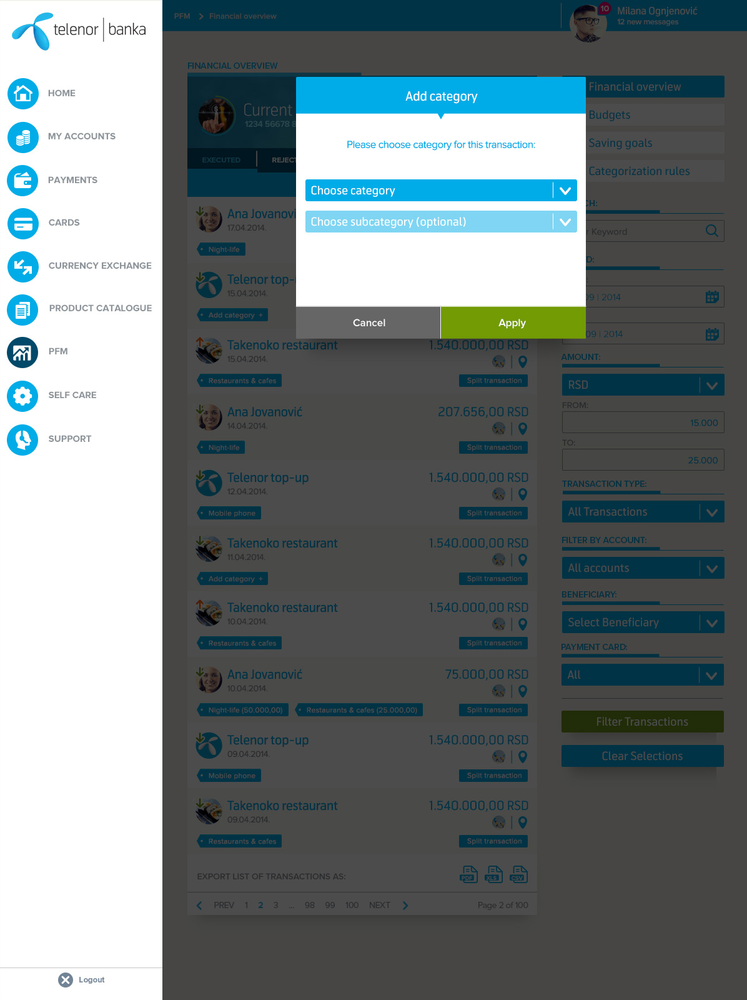
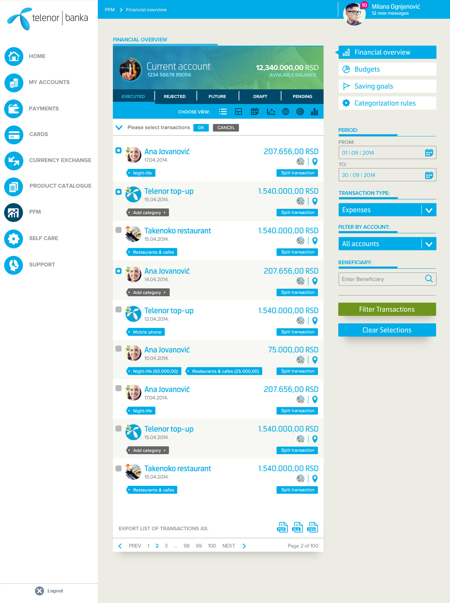
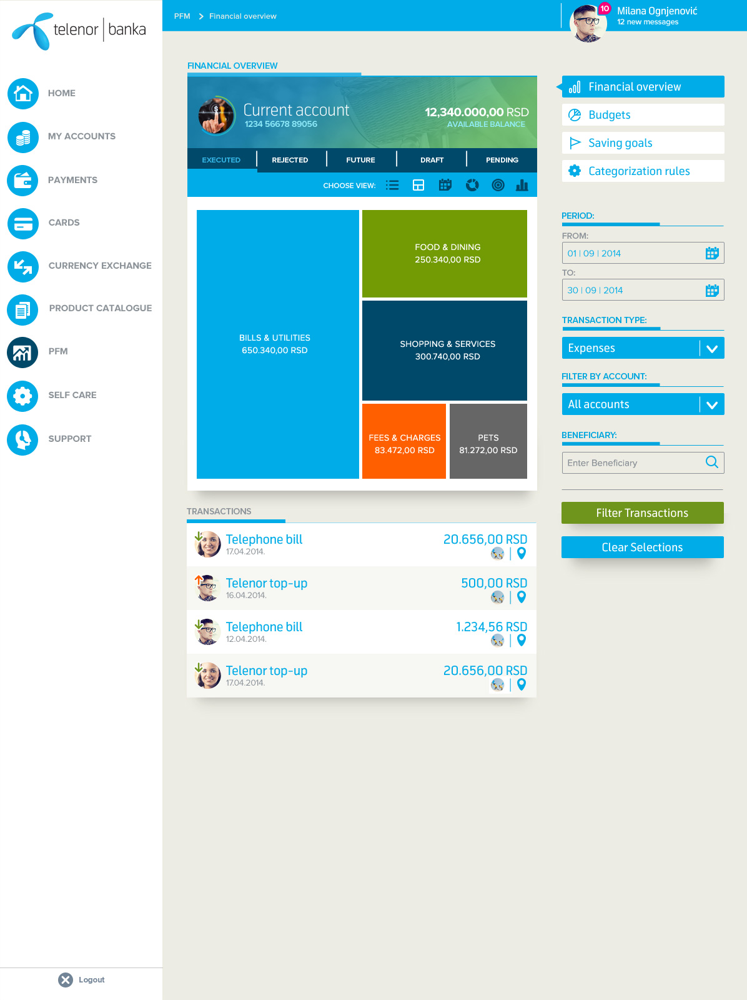

Personal Finance Management
===========================
Personal Finance Management is a set of activities performed by the customer on its financial data for the purpose of getting clear picture of the incomes/expenses trends, as well as enabling customer to manage monthly budget and personal financial goals.

Personal Finance Management starts with **categorization** of transactions into income, expense and savings & investment categories and subcategories. Majority of transactions should be automatically categorized, allowing the customer to manage categorization manually and using user categorization rules. Each transaction has a category and optionally a subcategory assigned. Categorization scheme used within the solution is described below. 

Besides spending categories, categories enum includes values for uncatogorized and split transactions.

PFM Frontend
============
PFM frontend is a single-page application written in Angular

Basic Features 5MD
--------------

### A1 List transactions 1

Present a list of transactions for categorization.
For each of transactions in the list present following information:
- Transaction id
- Beneficiary name
- Transaction date
- Direction (credit or debit represented as red/green arrow icon)
- Transaction amount
- Transaction currency
- Transaction kind
- Split marker (whether transaction is a split of another transaction)
- Category (PFM category of categorized transactions)
Note that:
- Transaction list should be filtered by account.
- Transaction list should be sorted by date (descending) and category (ascending).

### A2 Categorize a single transaction 1
Offer option to set or change the category of transaction.
- Display drop-downs with the list of all possible PFM categories
- Display drop-downs with the list of all possible PFM subcategories filtered by category dropdown value
- Previously set category and subcategory are preselected in the dropdowns
- user can optionally select the subcategory from the list
- upon succesfull categorization (click on Apply button), category of transaction is persisted to database via API call
- newly set category is presented on the transaction list screen

### A3 Categorize multiple selected transactions 1
Offer option to set or change the category of selected transactions.
- Display a button to categorize multiple transactions
- When button is clicked show a selection checkbox for each transaction
- Offer buttons to proceed with categorization or cancel selection
- When user clicks OK to proceed with categorization:
  - Display drop-downs with the list of all possible PFM categories
  - Display drop-downs with the list of all possible PFM subcategories filtered by category dropdown value
  - user can optionally select the subcategory from the list
- upon succesfull categorization (click on Apply button), categories of transactions are persisted to database via API call
- newly set categories are presented on the transaction list screen

### A4 Split transaction 2
Offer option to "split transaction" from the list of transactions into multiple transactions each having a specific category and amount.
- Display two splits initialy, offer option to add additional splits
- For each split:
  - Display drop-downs with the list of all possible PFM categories
  - Display drop-downs with the list of all possible PFM subcategories filtered by category dropdown value
  - Display an input for split transaction amount
  - user can optionally select the subcategory from the list
- upon succesfull split (click on Apply button), splits are persisted via API call
- newly added splits are presented on the transaction list screen
Not that:
- Sum of amounts from split transactions must be equal to amount of original transaction.
- New transactions (resulting from split) are recorded with same attributes as the original transaction apart from category, amount and split marker.

Extra credit features 5MD
-----------------
### A5 Present spending by category with tree map chart 1
Tree map view is the chart that provides data tree in form of rectangles of various colours and sizes. Each rectangle displays information on name of category and spent amount. Size of rectangle is directly proportional to the sum value of spending transactions for the category. Only top level categories are displayed initially.
- When user clicks on a category rectangle:
  - Tree map view of subcategories related to the category is displayed
Note that:
- Chart displays information for current month but user can specify other date period

### A6 Responsive (10 points)

Above and beyond
----------------
- Additional visual representations, OAuth2 + 2nd factor (Auth0)

### Assumptions
- You will create a Prism mock of PFM API to simulate backend calls and data

Personal Finance Management Backend
====================================

PFM microservice written in .Net core

Basic Features
--------------

### B1 Import transactions from bank file (csv)
### B2 List transactions with filters and pagination
### B2 Automatically assign categories based on predefined rules
### B3 Categorize transaction
### B4 Split transaction

Advanced features
-----------------
### Ax Analytical view of spending by categories
### Ax Basic authentication
### Ax Basic Web UI (functional)
### A2 Budgets
### A3 Responsive

Above and beyond
----------------

### Assumptions
- APIs you expose will conform to PFM API specifications
- 

